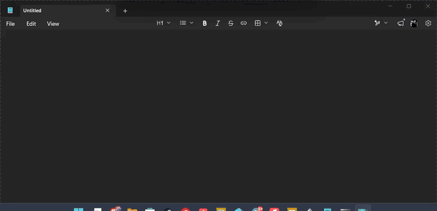

<h1 align="center">🎙️ WhisperKey</h1>

<p align="center">
  <b>Local, private, push-to-talk dictation for Windows.</b><br>
  Hold a key, speak, release — your words are typed into whatever app you're using.
</p>

<p align="center">
  
  
  
  
</p>

---

## Demo

<!-- Record a short GIF and save it as docs/demo.gif to make this appear. -->
<p align="center">
  
</p>

## What it is

WhisperKey turns speech into text **entirely on your machine** — no API keys, no
accounts, nothing sent to the cloud. It uses OpenAI's Whisper model (via the fast
[faster-whisper](https://github.com/SYSTRAN/faster-whisper) / CTranslate2 engine)
running on your NVIDIA GPU, so transcription is quick and completely private.

Hold **F9**, talk, let go. The transcript is pasted into the focused window —
your editor, browser, chat app, email, anywhere you can type.

## Features

- 🔒 **100% local & private** — no internet needed after the first model download.
- ⚡ **Fast** — GPU inference (NVIDIA / CUDA) transcribes short clips in well under a second.
- ⌨️ **Push-to-talk** — hold a global hotkey from any app; no window switching.
- 🖥️ **Works everywhere** — pastes into any focused text field via the clipboard.
- 🔴 **Clear status** — a system-tray icon and a small on-screen indicator show when it's listening/transcribing.
- ✍️ **Real punctuation & casing** — question marks, commas, capitalization.
- 🛠️ **Configurable** — model size, hotkey, GPU/CPU, microphone, all in a simple JSON file.

## Requirements

- **Windows 10/11**
- **Python 3.9+** (3.12 recommended)
- **An NVIDIA GPU** for the default GPU mode — or run on CPU (see [No GPU?](#no-gpu))
- A microphone 🙂

## Install (from source)

```powershell
git clone https://github.com/stevenmettler/WhisperKey.git
cd WhisperKey
python -m venv venv
venv\Scripts\activate
pip install -r requirements.txt
```

On the default GPU settings this also installs the CUDA runtime libraries
(`nvidia-cublas-cu12`, `nvidia-cudnn-cu12`) that the engine needs — no separate
CUDA Toolkit install required.

## Run

```powershell
python main.py
```

- The first run downloads the speech model (~150–500 MB depending on size) and
  caches it locally; later runs start instantly.
- A **grey circle** appears in your system tray. Grey = idle, **red** =
  recording, amber = model failed to load.
- **Hold F9, speak, release.** While you hold F9 a small red **"Recording"** pill
  shows at the bottom of the screen; it turns amber **"Transcribing"** while the
  model runs, then the text pastes in.
- Quit from the tray icon's right-click menu.

## Configuration

Edit `config.py` defaults, or — after the first run — edit the generated
`settings.json`:

| Setting | What it does | Default |
|---|---|---|
| `model_size` | `tiny.en` → `base.en` → `small.en` → `medium.en` → `large-v3` (faster → more accurate) | `small.en` |
| `device` | `cuda` (NVIDIA GPU) or `cpu` | `cuda` |
| `compute_type` | `float16` (GPU) or `int8` (CPU) | `float16` |
| `hotkey` | any key name (`f9`, `scroll lock`, `caps lock`, …) | `f9` |
| `mic_device` | `null` = system default, or a device index from `python audio_capture.py` | `null` |
| `initial_prompt` | a sentence ending in varied punctuation; nudges the model to punctuate | (a default) |
| `show_overlay` | show the on-screen recording indicator | `true` |

### No GPU?

Set these in `settings.json` and WhisperKey runs on CPU (slower, but works):

```json
{ "device": "cpu", "compute_type": "int8", "model_size": "base.en" }
```

## Building a standalone .exe

You don't need this to use WhisperKey, but if you want a single executable:

```powershell
pip install pyinstaller
pyinstaller build.spec --noconfirm      # -> dist\WhisperKey.exe (onefile, windowed)
```

The `.exe` is large (~1.4 GB) because it bundles the CUDA libraries. If a
packaged build ever misbehaves, `build_debug.spec` produces a console build with
visible tracebacks, and these built-in checks help:

```powershell
python main.py --selftest test.wav     # loads the model and transcribes (no mic needed)
python main.py --overlay-demo          # shows the on-screen indicator for a few seconds
```

> Note: the prebuilt `.exe` bundles NVIDIA's proprietary CUDA/cuDNN DLLs, which
> have their own redistribution terms — that's why this project is distributed as
> source. See [THIRD_PARTY_NOTICES.md](THIRD_PARTY_NOTICES.md).

## How it works

```
[hold F9] → record mic (16 kHz mono) → faster-whisper on GPU → clipboard → paste (Ctrl+V) → [restore clipboard]
```

Each piece is a small, self-contained module: `audio_capture.py`,
`transcriber.py`, `injector.py`, `hotkey_listener.py`, `overlay.py`, wired
together in `main.py`. Everything logs to
`%LOCALAPPDATA%\WhisperKey\whisperkey.log`.

## Troubleshooting

- **Nothing gets typed** → open `%LOCALAPPDATA%\WhisperKey\whisperkey.log`. If it
  shows `recording stopped (X.XXs captured)` but an empty transcript, your mic
  isn't picking up audio — check the Windows sound input settings.
- **The hotkey doesn't fire** → some systems require running the terminal / app
  as Administrator for global key hooks.
- **`Library cublas64_12.dll ... not found` / CUDA errors** → the GPU libraries
  aren't installed; `pip install -r requirements.txt`, or switch to CPU mode.
- **Missing punctuation on fast speech** → try `"model_size": "medium.en"`.

## Contributing

Issues and pull requests welcome. Keep changes small and focused; the codebase
is intentionally tiny and readable.

## License

MIT — see [LICENSE](LICENSE). Built on excellent open-source work; see
[THIRD_PARTY_NOTICES.md](THIRD_PARTY_NOTICES.md) for the full dependency list and
licenses.
